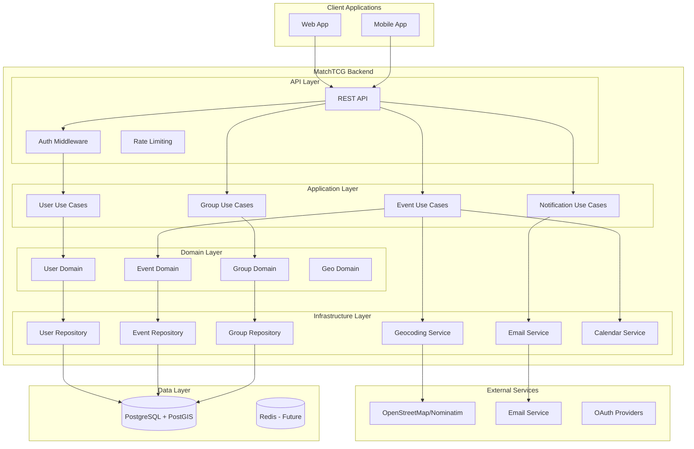
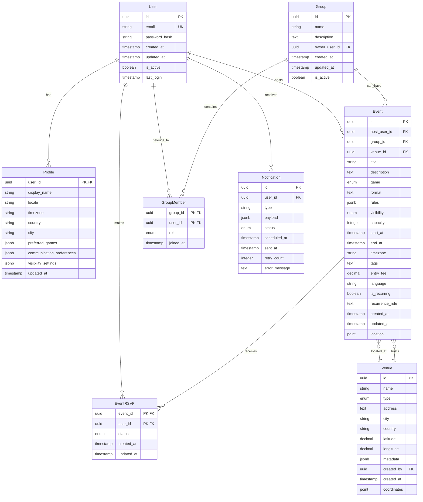

# Design Document

## Overview

MatchTCG backend is designed as a clean, scalable Go-based API service that supports Trading Card Game event management. The architecture follows hexagonal/clean architecture principles with clear separation between domain logic, use cases, and external adapters. The system is optimized for cost-efficiency while maintaining the ability to scale to millions of users.

The backend serves as the single source of truth for all data and business logic, exposing RESTful APIs consumed by separate mobile and web applications. The design prioritizes GDPR compliance, geospatial capabilities, and integration with external calendar and mapping services.

## Architecture

### System Architecture



### Clean Architecture Layers

**Domain Layer**: Contains business entities, value objects, and domain services. No external dependencies.

**Application Layer**: Orchestrates domain objects and coordinates with infrastructure. Contains use cases and application services.

**Infrastructure Layer**: Implements interfaces defined by inner layers. Handles database access, external API calls, and framework-specific code.

**API Layer**: HTTP handlers, middleware, request/response models, and routing configuration.

## Components and Interfaces

### Core Services

#### Authentication Service
- JWT token generation and validation
- OAuth integration (Google, Apple)
- Password hashing and verification
- Token refresh and revocation

#### User Service
- Profile management
- GDPR compliance operations
- User preferences and settings

#### Event Service
- Event CRUD operations
- Geospatial search with PostGIS
- RSVP management and capacity handling
- Event visibility and privacy controls

#### Group Service
- Group creation and management
- Role-based access control
- Member invitation and management

#### Notification Service
- Email template management
- Notification scheduling and delivery
- Retry logic for failed deliveries

#### Calendar Service
- ICS file generation
- Google Calendar integration
- Personal calendar feed management

#### Geocoding Service
- Address to coordinates conversion
- Reverse geocoding capabilities
- Provider abstraction (Nominatim/Google)

### Repository Interfaces

```go
type UserRepository interface {
    Create(ctx context.Context, user *User) error
    GetByID(ctx context.Context, id string) (*User, error)
    GetByEmail(ctx context.Context, email string) (*User, error)
    Update(ctx context.Context, user *User) error
    Delete(ctx context.Context, id string) error
    ExportData(ctx context.Context, id string) (*UserData, error)
}

type EventRepository interface {
    Create(ctx context.Context, event *Event) error
    GetByID(ctx context.Context, id string) (*Event, error)
    Search(ctx context.Context, params SearchParams) ([]*Event, error)
    SearchNearby(ctx context.Context, lat, lon float64, radiusKm int, params SearchParams) ([]*Event, error)
    Update(ctx context.Context, event *Event) error
    Delete(ctx context.Context, id string) error
}

type GroupRepository interface {
    Create(ctx context.Context, group *Group) error
    GetByID(ctx context.Context, id string) (*Group, error)
    GetUserGroups(ctx context.Context, userID string) ([]*Group, error)
    AddMember(ctx context.Context, groupID, userID string, role Role) error
    RemoveMember(ctx context.Context, groupID, userID string) error
    UpdateMemberRole(ctx context.Context, groupID, userID string, role Role) error
}
```

## Data Models

### Entity Relationship Diagram



### Key Design Decisions

**PostgreSQL + PostGIS**: Chosen over NoSQL for strong consistency requirements, complex relational queries, and native geospatial capabilities. The JSONB fields provide flexibility for metadata while maintaining ACID properties.

**UUID Primary Keys**: Enables distributed systems and prevents ID enumeration attacks.

**Soft Deletes**: Implemented via `is_active` flags for GDPR compliance and data recovery.

**Timezone Handling**: All timestamps stored in UTC, converted to user timezone in application layer.

**Geospatial Indexing**: PostGIS spatial indexes on venue coordinates and computed event locations for efficient radius searches.

## API Design

### RESTful Endpoints

#### Authentication
- `POST /api/v1/auth/register` - User registration
- `POST /api/v1/auth/login` - User login
- `POST /api/v1/auth/refresh` - Token refresh
- `POST /api/v1/auth/logout` - User logout
- `POST /api/v1/auth/oauth/{provider}` - OAuth authentication

#### Users & Profiles
- `GET /api/v1/me` - Get current user profile
- `PUT /api/v1/me` - Update current user profile
- `DELETE /api/v1/me` - Delete user account (GDPR)
- `GET /api/v1/me/export` - Export user data (GDPR)
- `GET /api/v1/users/{id}` - Get public user profile

#### Events
- `POST /api/v1/events` - Create event
- `GET /api/v1/events/{id}` - Get event details
- `PUT /api/v1/events/{id}` - Update event
- `DELETE /api/v1/events/{id}` - Delete event
- `GET /api/v1/events` - Search events with filters
- `POST /api/v1/events/{id}/rsvp` - RSVP to event
- `GET /api/v1/events/{id}/attendees` - Get attendee list

#### Groups
- `POST /api/v1/groups` - Create group
- `GET /api/v1/groups/{id}` - Get group details
- `PUT /api/v1/groups/{id}` - Update group
- `DELETE /api/v1/groups/{id}` - Delete group
- `POST /api/v1/groups/{id}/members` - Add group member
- `DELETE /api/v1/groups/{id}/members/{userId}` - Remove member
- `PUT /api/v1/groups/{id}/members/{userId}` - Update member role

#### Venues
- `POST /api/v1/venues` - Create venue
- `GET /api/v1/venues/{id}` - Get venue details
- `GET /api/v1/venues` - Search venues

#### Calendar Integration
- `GET /api/v1/events/{id}/ics` - Download ICS file
- `GET /api/v1/events/{id}/google-calendar` - Google Calendar deep link
- `GET /api/v1/calendar/feed/{token}.ics` - Personal calendar feed

### Request/Response Models

#### Event Search Parameters
```json
{
  "near": "38.7223,-9.1393",
  "radiusKm": 25,
  "startFrom": "2024-01-01T00:00:00Z",
  "days": 30,
  "game": "mtg",
  "format": "standard",
  "visibility": "public",
  "limit": 20,
  "offset": 0
}
```

#### Event Response
```json
{
  "id": "uuid",
  "title": "Friday Night Magic",
  "description": "Weekly Standard tournament",
  "game": "mtg",
  "format": "standard",
  "host": {
    "id": "uuid",
    "displayName": "John Doe"
  },
  "venue": {
    "id": "uuid",
    "name": "Local Game Store",
    "address": "123 Main St, Lisbon",
    "coordinates": [38.7223, -9.1393]
  },
  "startAt": "2024-01-05T19:00:00Z",
  "endAt": "2024-01-05T23:00:00Z",
  "timezone": "Europe/Lisbon",
  "capacity": 32,
  "attendeeCount": 18,
  "rsvpStatus": "going",
  "visibility": "public",
  "tags": ["competitive", "standard"],
  "entryFee": 5.00,
  "language": "pt"
}
```

## Geospatial Strategy

### PostGIS Implementation

**Spatial Data Types**: Use `POINT` type for venue coordinates and computed event locations.

**Spatial Indexes**: Create GIST indexes on coordinate columns for efficient spatial queries.

**Distance Queries**: Implement radius search using `ST_DWithin` function:
```sql
SELECT * FROM events e
JOIN venues v ON e.venue_id = v.id
WHERE ST_DWithin(
    v.coordinates::geography,
    ST_Point($longitude, $latitude)::geography,
    $radius_meters
)
AND e.start_at >= $start_date
ORDER BY v.coordinates <-> ST_Point($longitude, $latitude);
```

**Nearest Neighbor**: Use KNN operator `<->` for "nearest events" queries.

### Geocoding Strategy

**Primary Provider**: Nominatim (OpenStreetMap) for cost efficiency
- Rate limiting: 1 request/second
- Caching: Store geocoded results to minimize API calls
- Fallback: Manual coordinate entry

**Provider Abstraction**: Interface allows switching to Google Maps Geocoding API if budget permits
```go
type GeocodingService interface {
    Geocode(ctx context.Context, address string) (*Coordinates, error)
    ReverseGeocode(ctx context.Context, lat, lon float64) (*Address, error)
}
```

## Security Implementation

### Authentication & Authorization

**JWT Strategy**:
- Access tokens: 15-minute expiry
- Refresh tokens: 7-day expiry with rotation
- Token blacklisting for logout
- Asymmetric signing (RS256)

**Password Security**:
- Argon2id hashing with salt
- Minimum 8 characters, complexity requirements
- Rate limiting on login attempts

**OAuth Integration**:
- Google OAuth 2.0 with PKCE
- Apple Sign-In with JWT validation
- Automatic account linking by email

### API Security

**Rate Limiting**: Token bucket algorithm
- Authenticated users: 1000 requests/hour
- Anonymous users: 100 requests/hour
- Geospatial search: 60 requests/hour

**Input Validation**: 
- JSON schema validation
- SQL injection prevention
- XSS protection with output encoding

**CORS Configuration**: Restrictive origins for production

## Privacy & GDPR Compliance

### Data Minimization
- Collect only necessary personal data
- Automatic data retention policies
- Regular cleanup of expired tokens and sessions

### User Rights Implementation
- **Right to Access**: `/api/v1/me/export` endpoint
- **Right to Rectification**: Profile update endpoints
- **Right to Erasure**: Account deletion with cascading cleanup
- **Right to Portability**: JSON export of all user data

### Consent Management
- Explicit consent during registration
- Granular communication preferences
- Audit logging of consent changes

### Data Protection
- Encryption at rest (database level)
- TLS 1.3 for data in transit
- Personal data pseudonymization where possible

## Scalability & Performance Strategy

### Database Optimization

**Indexing Strategy**:
```sql
-- User lookups
CREATE INDEX idx_users_email ON users(email);
CREATE INDEX idx_users_active ON users(is_active) WHERE is_active = true;

-- Event searches
CREATE INDEX idx_events_start_at ON events(start_at) WHERE start_at > NOW();
CREATE INDEX idx_events_game_visibility ON events(game, visibility);
CREATE INDEX idx_events_location_gist ON events USING GIST(location);

-- Geospatial
CREATE INDEX idx_venues_coordinates_gist ON venues USING GIST(coordinates);

-- RSVP queries
CREATE INDEX idx_event_rsvp_event_status ON event_rsvp(event_id, status);
```

**Partitioning Strategy**:
- Events table partitioned by month for historical data management
- Automatic partition creation and cleanup

**Query Optimization**:
- Prepared statements for common queries
- Connection pooling with pgxpool
- Read replicas for search-heavy operations

### Caching Strategy (Future)

**Redis Implementation**:
- Event search results (5-minute TTL)
- User session data
- Geocoding results (24-hour TTL)
- Popular venue information

**Cache Invalidation**:
- Event updates invalidate related caches
- User profile changes clear session cache

### Horizontal Scaling

**Stateless Design**: All session data in JWT or external cache
**Database Sharding**: User-based sharding strategy documented
**Load Balancing**: Round-robin with health checks

## Calendar Integration

### ICS Generation

**VEVENT Format**:
```
BEGIN:VEVENT
UID:event-{uuid}@matchtcg.com
DTSTART:{start_utc}
DTEND:{end_utc}
SUMMARY:{title}
DESCRIPTION:{description}\n\nFormat: {format}\nRules: {rules}
LOCATION:{venue_address}
ORGANIZER:CN={host_name}:MAILTO:{host_email}
URL:https://matchtcg.com/events/{id}
STATUS:CONFIRMED
END:VEVENT
```

**Google Calendar Integration**:
- Deep link generation: `https://calendar.google.com/calendar/render?action=TEMPLATE&text={title}&dates={start}/{end}&details={description}&location={address}`
- URL encoding for special characters
- Timezone conversion for display

**Personal Calendar Feeds**:
- Authenticated iCal feeds with unique tokens
- Real-time updates for RSVP changes
- Configurable event inclusion (going/interested)

## Error Handling

### Error Response Format
```json
{
  "error": {
    "code": "VALIDATION_ERROR",
    "message": "Invalid input data",
    "details": [
      {
        "field": "email",
        "message": "Invalid email format"
      }
    ],
    "requestId": "uuid"
  }
}
```

### Error Categories
- **4xx Client Errors**: Validation, authentication, authorization
- **5xx Server Errors**: Database, external service failures
- **Custom Codes**: Business logic errors (capacity exceeded, etc.)

### Retry Strategy
- Exponential backoff for external API calls
- Circuit breaker pattern for email service
- Graceful degradation for non-critical features

## Testing Strategy

### Unit Testing
- Domain logic with 90%+ coverage
- Repository interfaces with mocks
- Use cases with dependency injection

### Integration Testing
- Database operations with test containers
- API endpoints with test database
- External service integration with mocks

### End-to-End Testing
- Critical user journeys
- GDPR compliance workflows
- Calendar integration flows

### Performance Testing
- Load testing with realistic data volumes
- Geospatial query performance benchmarks
- Database connection pool optimization

## Deployment Architecture

### Environment Configuration

**Development**:
- Local PostgreSQL with PostGIS
- Docker Compose for dependencies
- Hot reload for rapid development

**Staging**:
- Managed PostgreSQL (single instance)
- Kubernetes deployment
- Production-like data volume

**Production**:
- Managed PostgreSQL with read replicas
- Kubernetes with horizontal pod autoscaling
- CDN for static assets
- Monitoring and alerting

### Infrastructure as Code
- Terraform for cloud resources
- Kubernetes manifests for application deployment
- Helm charts for configuration management

### Monitoring & Observability

**Metrics**: Prometheus with custom business metrics
**Logging**: Structured JSON logs with correlation IDs
**Tracing**: OpenTelemetry for distributed tracing
**Alerting**: Grafana dashboards with SLA monitoring

### CI/CD Pipeline
1. Code quality checks (linting, security scanning)
2. Unit and integration tests
3. Docker image building
4. Staging deployment and smoke tests
5. Production deployment with blue-green strategy

## Cost Optimization

### Database Strategy
- Single PostgreSQL instance for MVP
- Automated backup and point-in-time recovery
- Connection pooling to minimize resource usage

### Compute Resources
- Kubernetes resource limits and requests
- Horizontal pod autoscaling based on CPU/memory
- Spot instances for non-critical workloads

### External Services
- OpenStreetMap/Nominatim (free tier)
- Transactional email service (pay-per-use)
- Object storage for file uploads (future)

### Monitoring Costs
- Resource usage dashboards
- Cost allocation by feature
- Automated scaling policies to prevent overprovisioning